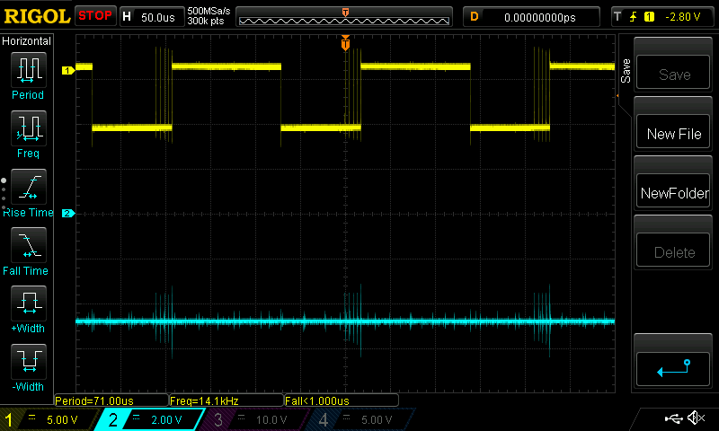

# zx-spectrum-minus5v

## A demonstration of the -5V charge pump circuit for the ZX Spectrum

I constructed the ZX Spectrum's -5V circut on breadboard so I could
experiment with it. It was useful in [this thread](https://spectrumcomputing.co.uk/forums/viewtopic.php?t=12266), where I was trying
(failing!) to help someone with an issue on their machine's -5V rail.
I didn't want to risk blowing up my Spectrum by experimenting on it
directly.

A 555 timer is used to generate a square wave similar to the one produced
by the TR4 oscillator in the ZX Spectrum. In fact, the output from the
555 is way cleaner than the Spectrum's oscillator which is a wobbly 
affair (yellow line):

The TR4 based circuit drives the charge pump which produces the -5V supply
for the Spectrum's 4116 DRAM chips. The cyan line is the negative side of
the input capacitor, which mirrors the input, only to the negative side.
Purple is the output of the circuit at about -12V, blue is that voltage
clamped by a zener diode. It's that circuit this experiment was used to investigate.

I built this circuit twice, on breadboard. The first is a version which I
found [online](https://www.allaboutcircuits.com/projects/build-your-own-negative-voltage-generator/).
This is basically the same as the original circuit in the Spectrum.

The second version is the one used to modify the Spectrum's original
circuit. This is the defacto version of the charge pump used in modern,
modified Spectrums and is documented [here](http://8and16bit.blogspot.com/2019/08/zx-spectrum-16k-48k-and-plus-models-dc.html).

The output from this circut is this:

The yellow trace is the input to the charge pump, and is essentially a
much cleaner version of the TR4-derived square wave. The 555 is way better
than Sinclair's original generator circuit.

The cyan trace is the output, as clamped by the 5.1V zener diode. It's a
bit noisy on the rising edges. I'm not sure why, but that noise goes away
if I remove the zener, or turn the input voltage down from 8V to anything
around 5V.

If this information is useful to anyone, by all means use it. This project
is in the public domain.

[Derek Fountain](https://www.derekfountain.org/), November 2024